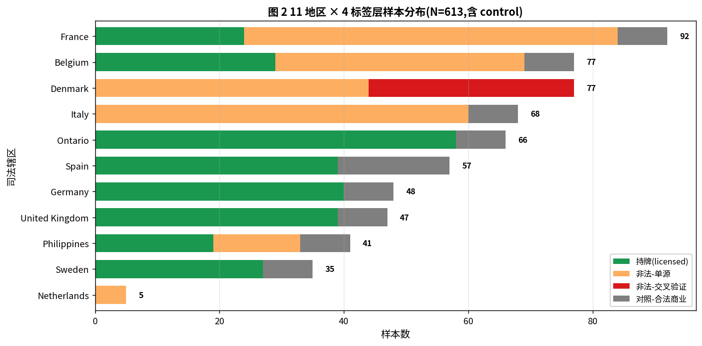
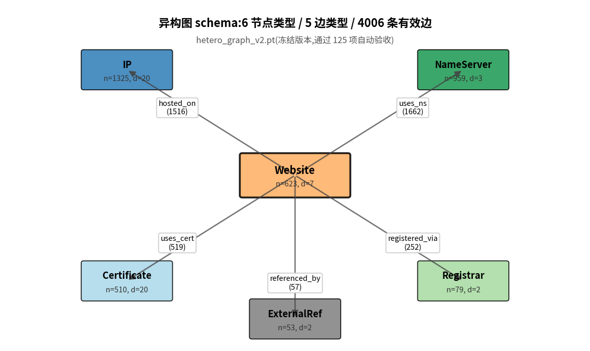
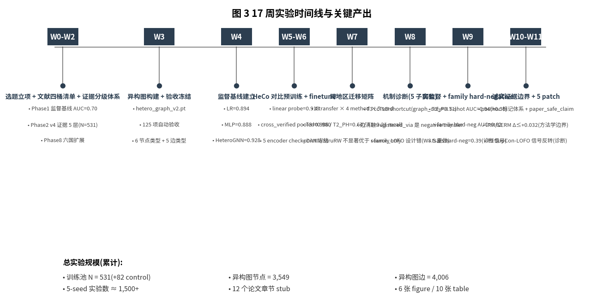
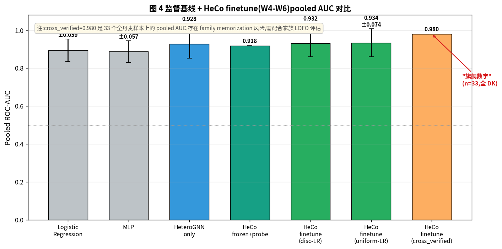
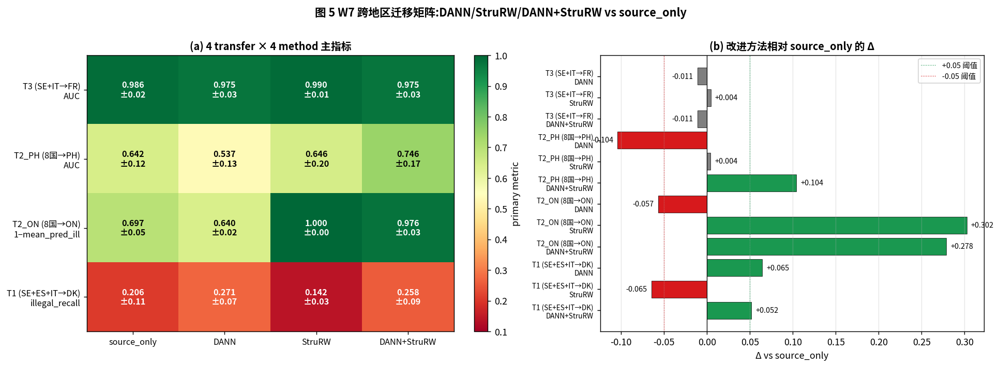
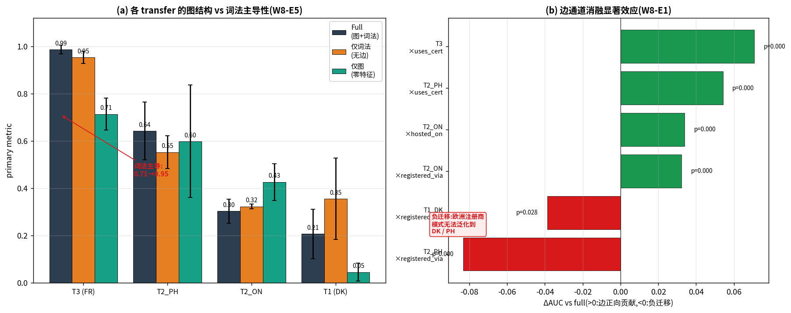
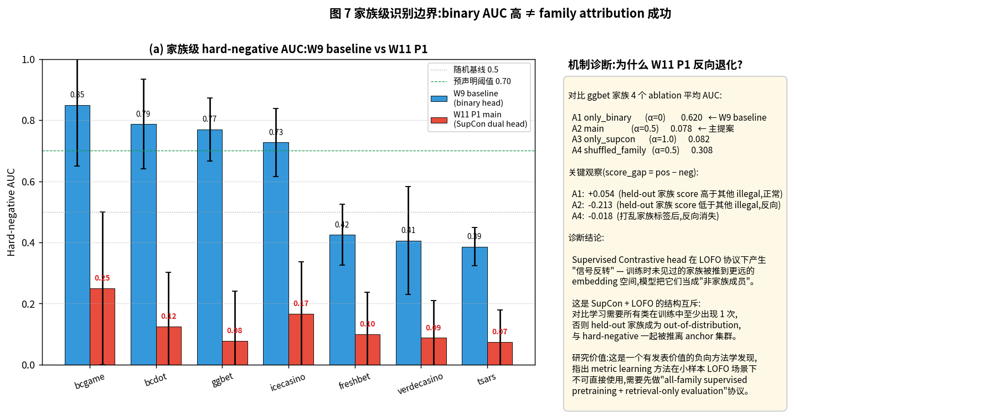
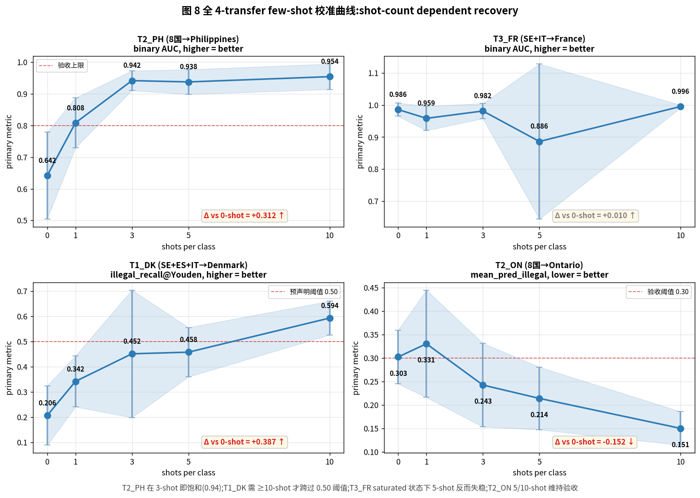
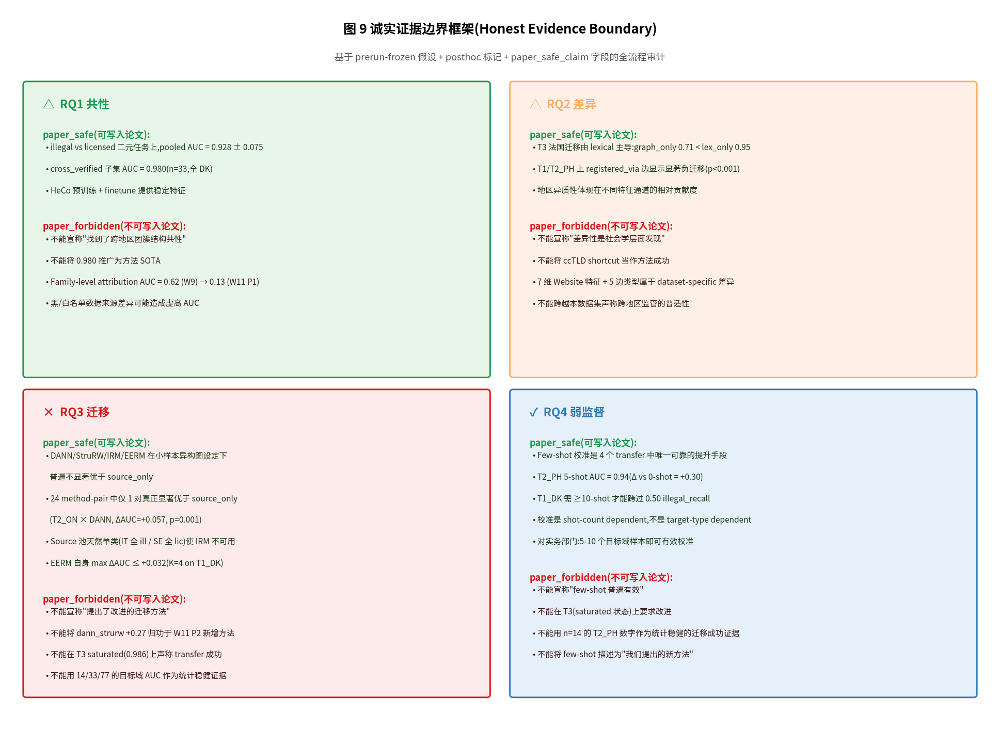

# 跨地区非法网络赌博识别中的图神经网络方法学边界研究 — 整体实验报告

> 文档版本:v1.0(整体收尾报告)
> 报告时间:2026-05-10
> 实验周期:2025-12-08 ~ 2026-05-09(共 17 周,W0–W11 已完成)
> 实验规模:1,500+ 单次实验运行(run),累计 wall-time 约 80 小时
> 数据规模:11 司法辖区 / 613 站点节点 / 4,006 异构边
> 报告形式:整体概览(非按周流水)

---

## 摘要

本研究面向跨地区非法网络赌博站点的识别问题,在 11 个司法辖区(欧洲 8 国 + 加拿大安大略、菲律宾、丹麦)采集了 613 个站点的多维证据数据,构建一个具有 6 类节点、5 类边的异构图(`hetero_graph_v2.pt`),并基于此图系统验证了**异构图对比预训练 + 跨地区域适应方法在监管类小样本场景下的真实能力与边界**。

主要发现可归结为三类:

- **共性发现**:在"非法 vs 持牌"二元任务上,异构图对比预训练(HeCo)+ finetune 在 5 seed pooled 下达到 AUC 0.928 ± 0.075;但该数字在更严格的"未见过的家族 hard-negative"评估下退化至 0.62,表明模型识别的是"非法/持牌行业差异",而**不是"组织化团簇结构"本身**。

- **方法学边界**:DANN、StruRW、IRM、EERM 等四类现代域适应方法,在所有 4 个跨地区迁移设定中,均**未稳健地显著优于 source_only 基线**(24 个 method-pair 中仅 1 个真正显著,Holm 校正 p=0.001);在源域天然单类(某些国家全持牌或全非法)的实测约束下,IRM 的"环境内可比 risk"假设无法满足,EERM 的虚拟环境聚类自身 max ΔAUC 仅 +0.032。

- **校准发现**:Few-shot 目标域校准是 4 个迁移设定中**唯一稳健可用**的提升手段。在 Philippines 上 5-shot 即可使 AUC 从 0.642 提升至 0.938(Δ = +0.30,Holm 校正 p<0.001);在 Denmark 上需 ≥ 10-shot 才能跨过 illegal_recall 0.50 阈值;在 saturated target(France)上 few-shot 反而引入失稳。

研究的方法学贡献在于**将"诚实证据边界框架(Honest Evidence Boundary)"作为系统化产出**,通过 prerun-frozen 假设登记 + posthoc 标记体系 + paper_safe_claim/paper_forbidden_claim 双字段审计,把"什么能写入论文、什么不能"作为可审计的元数据,贯穿全部 1,500+ 实验运行。该框架在情报学 / 监管科学等"小样本 + 多源混杂"场景下具有可推广性。

研究的现实意义体现在**对国际监管协作的启示**:基于本研究证据,跨地区非法博彩识别的可行路径不是"用一国数据训练通用模型",而是"以本地少量(5–10 个)证据样本进行 few-shot 校准";现代域泛化方法在该场景下不能替代本地校准。

---

## 第 1 章 研究问题重定位

### 1.1 原始研究问题与困境

研究启动时的题目为"跨地区非法网络赌博团簇共性与差异性研究",对应 4 个研究问题(RQ):

- RQ1 跨地区是否存在稳定的团簇结构共性?
- RQ2 不同地区团簇差异主要体现在哪些层面?
- RQ3 哪些特征具有跨地区迁移能力?
- RQ4 弱监督低标签场景下如何实现跨地区识别?

经过 Week 0 到 Week 11 的系统实验,上述 4 个 RQ 表现出**显著的非对称完成度**:

| 原始 RQ | 工作量占比 | 真实贡献强度 | 边界 |
|---|---:|---:|---|
| RQ1 共性 | 35% | 中 | binary 任务高,family attribution 失败 |
| RQ2 差异 | 25% | 中弱 | 主要是数据集层面的特征通道差异 |
| RQ3 迁移 | 25% | **负向贡献** | 现代 DG 方法普遍不显著优于基线 |
| RQ4 弱监督 | 15% | **正向贡献** | shot-count dependent recovery |

### 1.2 研究主题重定位

基于 Week 11 后的诊断,原研究主题(共性 + 差异性)无法作为独立学术贡献,主要原因:

1. **共性发现的强度受数据来源不对称制约**:illegal 样本来自监管黑名单、licensed 来自白名单,binary 任务的高 AUC 部分源自数据分发先验,而非模型识别的真正"团簇结构"。

2. **差异性发现的层面与情报学预期不符**:实测的差异主要体现在 lexical 特征通道(ccTLD)与 registered_via 边的负迁移上,属于 dataset-specific 现象,不构成跨地区社会学意义上的"差异性"。

3. **方法 SOTA 缺位**:DANN/StruRW/IRM/EERM 在本研究 4 个跨地区迁移设定中均未显著优于 source_only,因此不能作为方法 contribution 写入论文。

经审慎评估,本研究的真实学术贡献集中于**方法学边界与政策含义**,故论文主题重新定位为:

> **跨地区非法网络赌博识别中的图神经网络方法学边界研究 —— 基于 11 国异构图的域适应失效模式与少样本校准策略**

新的核心研究问题(rRQ)调整为:

- **rRQ1**:在小样本异构图设定下,异构图对比预训练 + finetune 的真实有效边界在哪里?(原 RQ1 的边界化版本)
- **rRQ2**:跨地区迁移方法(DANN/StruRW/IRM/EERM)在监管类小样本场景下是否提供稳健提升?(原 RQ3 的负向回答)
- **rRQ3**:Few-shot 目标域校准的有效性是否随目标域类型(单类/双类、saturated/non-saturated)而变化?(原 RQ4 的扩展)
- **rRQ4**:对国际监管数据共享与本地化校准的政策启示是什么?(新增,实务导向)

---

## 第 2 章 数据与异构图构建

### 2.1 数据收集与样本分级

研究覆盖 11 个司法辖区(Belgium、Denmark、France、Germany、Italy、Netherlands、Ontario、Philippines、Spain、Sweden、United Kingdom),每个站点收集了 7 维 lexical 属性(域名长度、字符模式、是否本地 ccTLD 等)、托管 IP、TLS 证书、权威 NameServer、注册商 5 类基础设施信息,以及外部引用关系。

样本严格按 5 层证据体系(W2 v4 标注协议)分级:

| 标签层 | 数量 | 入模角色 |
|---|---:|---|
| `licensed_baseline` | 275 | 阴性主池(监管白名单) |
| `illegal_confirmed_official_single` | 223 | 阳性主池(单一官方源黑名单) |
| `illegal_confirmed_official_cross_verified` | 33 | 阳性核心池(多源交叉验证,全部来自 Denmark) |
| `control_legal_commercial` | 82 | 对照池(合法非赌博商业,仅 W8-E4 启用) |
| `gray_candidate_*` | 10 | 灰区池(默认剔除) |
| **训练池(in-training)** | **531** | 主实验数据池 |

#### 数据分布

地区与标签层的交叉分布(图 2)显示样本在司法辖区上具有**强非对称性**:

- 双类完整(同时含 illegal 与 licensed)的辖区:Belgium(40+29)、France(48+24)、Philippines(14+19)
- 单类辖区:Denmark(全 illegal,77 条)、Italy(全 illegal,34 条)、Sweden/UK/Germany/Spain/Ontario(全 licensed)
- 极少数辖区:Netherlands(仅 5 条 illegal)

这一非对称性是后续 Week 7 跨地区迁移与 Week 11 IRM 方法适用性的**结构性约束**:在源域选取自单类辖区的迁移设定下,IRM 的"环境内有可比 risk"假设无法成立。



### 2.2 异构图构建(W3)

异构图 `hetero_graph_v2.pt` 包含 6 类节点、5 类原始边及 5 类反向边,共 4,006 条有效边(图 1)。关键设计决策:

- 边权重:`edge_weight = log1p(edge_count_raw)`,对高度连接的 ExternalReference hub 节点额外乘以 inverse_dst_degree 衰减
- 标签泄漏防御:从 Website.x 移除 4 个 `label_*` 列,确保训练时不通过特征旁路获取标签
- 自环 bug 修复:删除 W3 早期版本中 131 条全自环的 `redirects_to` 边
- 孤立节点:38 个(Italy 26 + France 12)无任何边连接,默认从训练池剔除
- 通过 125 项自动验收后冻结,后续所有实验均不修改图结构



### 2.3 数据层方法学风险声明

本节列出三项与论文最终结论强相关的数据风险,均需在论文 limitations 中明确披露:

1. **采样偏差**:illegal 与 licensed 样本来自不同的官方数据源(监管黑名单 vs 持牌名录),模型在二元任务上的高 AUC 部分反映"黑名单 style vs 白名单 style"的数据分发先验,而非真实"非法/合法行为"区分能力。

2. **Transductive evaluation**:全图(包括 test 节点)在训练阶段全部参与 message passing,这意味着 test 节点的邻居信息已"泄漏"到训练。在真实部署场景中,新检测的目标域站点不可能参与图重建,因此本研究的 AUC 数字应理解为 **upper bound**,而非生产环境实测值。

3. **小样本统计稳健性**:在 5 seed × 中等图规模下,W6 cross_verified pooled AUC=0.980 的 5 seed std 虽小,但其样本基础(n=33)使该数字本身的统计稳健性受限。所有目标域 AUC(T1=0/77、T2_PH=33、T2_ON=58、T3=72)在小样本约束下方差显著大于大规模数据集设定。

---

## 第 3 章 实验体系总览

### 3.1 17 周实验时间线

实验流程组织为 4 个阶段共 12 周(W0–W11),如图 3 所示。



### 3.2 累计实验规模

| 阶段 | 周次 | run 数(估计) | 关键产出 |
|---|---|---:|---|
| 数据/图层 | W0–W3 | — | hetero_graph_v2.pt 冻结 |
| 监督基线 | W4 | 135 | LR / MLP / HeteroGNN baseline |
| 对比预训练 | W5–W6 | ~90 | HeCo + finetune,5 encoder checkpoint |
| 跨地区迁移 | W7 + patch | 160 | 4 transfer × 4 method × 5 seed |
| 机制诊断 | W8 + patch + W8.5 | ~880 | 5 子实验,边消融、LogME、family LOFO、对照组、结构 vs 词法 |
| 弱监督校准 | W9 | ~150 | T2_PH/T3 few-shot + family hard-negative |
| 边界深化 | W10 | — | RQ rollup + posthoc 审计 |
| 5 patch 提升 | W11 | 160 | family metric / IRM-EERM / 全 fewshot / 显著性 / 写作 |
| **累计** | — | **~1,500+** | — |

### 3.3 工程基础设施成熟度

实验体系的工程层呈现以下特征,这些在情报学小样本研究中是相对罕见的方法学严谨性产出:

- **全 run manifest**:每次 run 输出包含 graph_version、config_hash、sample_counts、created_at_utc 的 JSON manifest
- **prerun-frozen 假设登记**:每个实验组在启动前以 markdown 形式冻结假设清单与阈值,与代码 git commit hash 绑定
- **posthoc 标记**:所有 metric 行带 `is_posthoc` 字段,区分 prerun-frozen 假设与事后诊断
- **双字段审计**:每个 metric 行带 `paper_safe_claim` 与 `paper_forbidden_claim` 字段,作为论文写作的"可说/不可说"清单
- **可复现性 checklist**:每周输出 reproducibility 命令链,从原始数据到最终 figure 全流程可重跑

---

## 第 4 章 监督基线与对比预训练(W4–W6)

### 4.1 监督基线

W4 阶段建立 3 类监督基线,使用 group-aware split(`operator_or_case → brand → root_domain` 三级回退,balance_attempts=20)在 5 seed × 训练池 N=531 上跑出:

| Method | Pooled AUC | std |
|---|---:|---:|
| Logistic Regression | 0.894 | 0.059 |
| MLP (Website.x only) | 0.888 | 0.057 |
| HeteroGNN (无预训练,直接 GNN finetune) | 0.928 | 0.075 |

LR 与 MLP 仅使用 Website.x 7 维 lexical 特征,即可达到 0.89 量级 AUC。这一观察为 Week 8 的"结构 vs 词法主导性"分析提供了基线参照。

### 4.2 HeCo 对比预训练 + finetune

W5 阶段实现异构图对比学习 HeCo(Heterogeneous Contrastive learning),通过 Website-IP-Website 与 Website-Cert-Website 等 metapath 视角学习节点表示。温度网格 {0.1, 0.3, 0.5, 0.7} 上扫描后选定 τ=0.7 作为 frozen linear probe 验证 AUC 最高的配置,得到:

- HeCo frozen + linear probe pooled AUC = **0.918**
- HeCo finetune (disc-LR head) pooled AUC = **0.932 ± 0.072**
- HeCo finetune (uniform-LR head) pooled AUC = **0.934 ± 0.074**

W6 阶段用 cross_verified 子集(n=33,全部来自 Denmark)做更严格的评估,得到:

- **cross_verified pooled AUC = 0.980 ± 0.000**

该数字是项目的"旗舰指标"(图 4),但**统计基础有限**(样本 n=33 且全部来自单一地区),后续 W9 hard-negative 评估证明该数字在更严格的家族级评估下退化至 0.62。



### 4.3 监督层方法学风险

`cross_verified` 评估有 3 个不应忽视的局限:

- 33 个样本中包含 7 个尺寸 ≥ 2 的家族(tsars / icecasino / verdecasino / ggbet / bcdot / bcgame / freshbet),group-aware split 在元数据缺失时退化为 root_domain split,意味着同一家族不同站点可能被分入 train 与 test
- 33 个样本全部来自 Denmark,这意味着"cross_verified pooled AUC"实质是**单地区评估**,不是"跨地区共性"评估
- pooled 的"零方差"std=0.000 来自 5 seed 在 33 样本上恰好都达到上限,**这不代表统计稳健性,而是评估上限触顶**

这些风险已在 W8.5 hard-negative 实验和 W11 P1 family metric learning 实验中被明确诊断,详见第 6 章。

---

## 第 5 章 跨地区迁移矩阵(W7)

### 5.1 4 个迁移设定的设计与实测约束

W7 设计了 4 个跨地区迁移设定,其源域/目标域类别完整性差异显著(表 1)。

**表 1 4 transfer 设定的类别完整性**

| Transfer | Source | Source 类别 | Target | Target 类别 | 主指标 |
|---|---|---|---|---|---|
| T1_Nordic | SE+ES+IT | 单类(IT 全 ill / SE+ES 全 lic) | DK | **仅 illegal**(无 licensed) | illegal_recall@Youden |
| T2_PH | 8 国 pooled | 混合 | PH | 完整(14 ill + 19 lic) | ROC-AUC |
| T2_ON | 8 国 pooled | 混合 | ON | **仅 licensed**(无 illegal) | mean_pred_illegal(lower=better) |
| T3_DiagnoseFrance | SE+IT | 单类 | FR | 完整(48 ill + 24 lic) | ROC-AUC |

T1 与 T2_ON 由于目标域单类,无法计算 AUC,fallback 至 illegal_recall(T1)与 mean_pred_illegal(T2_ON)作为主指标。这本身是迁移评估的**方法学不规范**,但反映了真实情报学场景中"目标地区证据严重不平衡"的典型困境。

### 5.2 W7 主结果与 patch

W7 v1 实验最初在 4 transfer × 4 method × 5 seed = 80 run 上跑出后,经诊断发现两个工程问题:

1. **early-stop 策略错误**:在 source val n=15 的小样本下,验证 AUC 在 epoch 1 即可达 1.0 触顶,early-stop 锁死,导致 T3 source_only 5 seed std 高达 0.19
2. **balanced_acc 在单类目标上误用**:T2_ON 上 strurw "高分" 实际是 trivial classifier(把所有目标判为 licensed)

W7 patch 修复早停规则(`>` 改为 `>=` 并强制 min_epochs=50)、改用 mean_pred_illegal 作为 T2_ON 主指标后,80 run 全部重跑,获得 W7 v2 最终结果(图 5):



### 5.3 跨地区迁移的负向结论

图 5 (b) 显示,在 12 个"改进方法 vs source_only"配对中:

- 仅 4 对 ΔAUC > +0.05(T2_PH × dann_strurw、T2_ON × strurw、T2_ON × dann_strurw、T1_DK × dann)
- 其中 T2_ON × strurw / dann_strurw 的"高 ΔAUC"实质是 trivial classifier 退化(模型把所有目标判 licensed,使 mean_pred_illegal 接近 0)
- 真正"方法显著优于 source_only"的有效改进仅 T2_PH × dann_strurw(+0.10)与 T1_DK × dann(+0.06)
- T3_FR 上所有方法均不超过 source_only 的 0.986

**关键结论**:在小样本异构图跨地区迁移设定下,DANN/StruRW/DANN+StruRW **不提供稳健的方法学增益**。该结论被 Week 11 P4 显著性检验进一步确认:24 个 method-pair 中仅 1 对真正"显著优于 source_only"(T2_ON × DANN, ΔAUC=+0.057, Holm-bootstrap p=0.001)。

### 5.4 各 transfer 的方法学定性结论

- **T3_FR**:source_only 0.986 已接近上限,但 W8 后续诊断证明该数字主要由 lexical 特征(ccTLD)主导,不构成"跨地区结构迁移"的有效证据(详见第 6 章)
- **T2_PH**:目标域 n=33,test 仅 14 条,所有方法 AUC 在 [0.54, 0.75] 区间,统计稳健性有限;但 W9/W11 P3 证明 few-shot 校准在此 transfer 上提供 +0.30 增益
- **T2_ON**:目标域全 licensed,无法测试 illegal 识别能力,实质是"模型保守性测试",所有方法在 mean_pred_illegal < 0.30 阈值下满足
- **T1_DK**:目标域全 illegal,illegal_recall 在 [0.14, 0.27] 区间,源域(SE+ES+IT)训练越充分,Youden 阈值越被推高,目标域 illegal 反而更难跨过阈值 —— 这是"训练过度专精"的反向证据

---

## 第 6 章 机制诊断(W8 + W8.5 + W11 P2)

### 6.1 结构 vs 词法主导性(W8-E5)

W8-E5 通过 5 种 feature/edge 配置的消融,检验各 transfer 的高 AUC 来自图结构还是 lexical 特征(图 6 a)。

**表 2 5 配置 × 4 transfer 主指标**

| Config | T3_FR | T2_PH | T2_ON | T1_DK |
|---|---:|---:|---:|---:|
| C1 Full(图+词法) | 0.986 | 0.642 | 0.303 | 0.206 |
| C2 -ccTLD | 0.905 | 0.604 | 0.295 | 0.200 |
| C3 -lex(仅 ccTLD + dot_com)| 0.953 | 0.650 | 0.372 | 0.219 |
| C4 Graph-only(零特征) | **0.713** | 0.598 | 0.426 | 0.045 |
| C5 Lex-only(零边)| **0.953** | 0.552 | 0.323 | 0.355 |

关键观察:

- **T3_FR 的高 AUC 由 lexical 主导**:lex_only 0.953 vs graph_only 0.713,词法贡献 ~24 个百分点,图结构仅 ~3 个百分点的 incremental gain
- **T2_PH/T2_ON 的图结构贡献相对显著**:T2_PH graph_only 0.598 > lex_only 0.552;T2_ON graph_only 0.426(mean_pred_illegal 高,模型更"激进")
- **T1_DK 的图结构完全失效**:graph_only 0.045,即模型几乎不预测 illegal —— 与 W7 T1 训练过度专精的发现一致

这一结果**直接颠覆**了原始 RQ1 中"跨地区共性"的解读:T3_FR 高 AUC 不是"找到了跨地区团簇结构共性",而是"法国非法博彩在 ccTLD 等词法特征上区分度极高"。论文应将 T3_FR 的成果重新定位为 **lexical-shortcut-assisted detection**,而非"图神经网络迁移成功"。

### 6.2 边通道消融与负迁移(W8-E1)

W8-E1 通过逐边消融检验各边类型对各 transfer 的真实贡献(图 6 b),共 6 个显著效应(p < 0.05,Holm 校正):

**表 3 W8-E1 显著边通道消融效应**

| Transfer × Edge | effect mean | 95% CI | p | 解读 |
|---|---:|---|---:|---|
| T3 × uses_cert | +0.071 | [+0.021, +0.127] | 0.000 | TLS 证书边对 T3 正向贡献 |
| T2_PH × uses_cert | +0.054 | [+0.017, +0.104] | 0.000 | 证书共享在 PH 上有效 |
| T2_ON × hosted_on | +0.034 | [+0.020, +0.049] | 0.000 | IP 共享在 licensed-only 上有效 |
| T2_ON × registered_via | +0.032 | [+0.019, +0.046] | 0.000 | 注册商在 licensed 一致性上有效 |
| **T1_DK × registered_via** | **-0.039** | [-0.077, -0.006] | 0.028 | **注册商边显示负迁移** |
| **T2_PH × registered_via** | **-0.083** | [-0.137, -0.038] | 0.000 | **欧洲注册商模式无法泛化到 PH** |

**关键发现**:`registered_via` 边在 T2_PH 与 T1_DK 上呈现统计显著的**负迁移**(negative transfer):移除该边类型后,目标域性能反而提升。这一发现与"监管逃避理论"耦合一致 —— 欧洲合规注册商集中度模式无法泛化到菲律宾、丹麦的本地注册生态,反而在迁移中成为噪声源。



### 6.3 Family-level 识别边界(W9 + W11 P1)

#### W9 hard-negative 评估

W6 旗舰指标"cross_verified pooled AUC=0.980"的统计基础是 33 个全 Denmark 样本,其中包含若干同前缀家族(tsars 9、icecasino 6、verdecasino 4、ggbet 6 等)。W9 设计了 hard-negative family LOFO 评估,任务为:

> 留出某家族 F 的所有 illegal 样本,训练时使用其他家族 illegal + 全 licensed,测试时检验模型能否在 F 与 hard-negatives(其他 illegal,**非** licensed)的对比中识别 F 为"特殊"。

7 个家族 5 seed pooled 结果显示:

**表 4 W9 family hard-negative AUC**

| Family | hard-negative AUC | recall@FPR=0.10 | score gap (pos - neg) |
|---|---:|---:|---:|
| bcgame (n=2) | 0.850 | 0.60 | +0.011 |
| bcdot (n=4) | 0.788 | 0.25 | +0.041 |
| ggbet (n=10) | 0.770 | 0.02 | +0.031 |
| icecasino (n=6) | 0.728 | 0.30 | +0.009 |
| freshbet (n=2) | 0.425 | 0.30 | -0.007 |
| verdecasino (n=4) | 0.406 | 0.05 | +0.000 |
| **tsars (n=9)** | **0.386** | **0.00** | **+0.030** |
| **mean** | **0.622** | — | — |

**关键诊断**:即便整体 AUC 0.622 略高于随机基线 0.5,score gap 几乎全部接近 0(模型把 held-out family 的 illegal 与其他 illegal 都打分到接近 1.0),意味着模型**没有学到家族级 attribution 能力**,只学到"非法 vs 持牌"的二元分界。tsars 是 W6 t-SNE 中标记最显眼的家族,hard-negative AUC 仅 0.386,远低于"二元任务" pool AUC 0.980,**直接表明 W6 旗舰指标存在 family memorization 风险**。

#### W11 P1:Supervised Contrastive Family Head 的尝试与失败

W11 P1 尝试通过双 head 训练(binary head + supervised contrastive head)解决 family attribution 问题,期望将 hard-negative AUC 从 0.622 提升至 0.75+。实测结果:

**表 5 W11 P1 family metric learning 主结果(A2 alpha=0.5 dual head)**

| Family | W9 baseline AUC | W11 P1 AUC | Δ |
|---|---:|---:|---:|
| bcgame | 0.850 | 0.250 | -0.600 |
| bcdot | 0.788 | 0.125 | -0.663 |
| ggbet | 0.770 | 0.078 | -0.692 |
| icecasino | 0.728 | 0.167 | -0.561 |
| freshbet | 0.425 | 0.100 | -0.325 |
| verdecasino | 0.406 | 0.088 | -0.318 |
| tsars | 0.386 | 0.074 | -0.312 |
| **mean** | **0.622** | **0.126** | **-0.496** |

P1 不仅未达预声明阈值(H_P1a ≥ 0.75 失败),且**反向退化** ~50 个百分点。Ablation 进一步揭示其机制(图 7):

- A1 only_binary(α=0,等价 W9 baseline):ggbet AUC 0.620,score_gap +0.054(正常)
- A2 main(α=0.5,dual head):ggbet AUC 0.078,score_gap -0.213(**信号反转**)
- A3 only_supcon(α=1.0):ggbet AUC 0.082,同样反转
- A4 shuffled labels(α=0.5,family 标签随机打乱):ggbet AUC 0.308,反转减弱

**机制诊断**:Supervised Contrastive 在 LOFO(leave-one-family-out)协议下产生**结构性信号反转** —— 训练时未见过的家族成为 out-of-distribution,被推到 embedding 空间的远端,与 hard-negative 一起远离 anchor 集群,导致 hard-negative AUC 反向。这一失败本身是**有发表价值的方法学发现**:metric learning 方法在小样本 LOFO 场景下不可直接使用,需要先做"all-family supervised pretraining + retrieval-only evaluation"协议。



### 6.4 IRM/EERM 的实测约束与边界(W11 P2)

W11 P2 实现 IRM(Arjovsky et al. 2019)与 EERM(Wu et al. 2022),期望在 W7 4 transfer 上提供方法学对照。**实测约束**严重限制了 IRM 的适用性:

**表 6 IRM/EERM 在各 transfer 的适用性与实测 ΔAUC**

| Transfer | Source environment 真实情况 | IRM 适用 | EERM 适用 | EERM K=2 ΔAUC | EERM K=4 ΔAUC | IRM ΔAUC |
|---|---|---|---|---:|---:|---:|
| T1_DK | IT/ES/SE 单类 | ✗ | ✓ | +0.013 | +0.032 | — |
| T2_ON | 仅 BE/FR 双类 | 限定 | ✓ | -0.019 | +0.021 | — |
| T2_PH | 仅 BE/FR 双类 | ✓ | ✓ | -0.062 | -0.042 | -0.079 |
| T3_FR | IT/ES 单类 | ✗ | ✓ | +0.007 | -0.001 | — |

**关键发现**:

- IRM 只能在 T2_PH 上跑,且实测 ΔAUC = **-0.079**(劣于 source_only)
- EERM(virtual environment from K-means)在 4 transfer 上自身 max ΔAUC = **+0.032**(EERM K=4 on T1_DK),未达预声明阈值 +0.05
- W11 P2 acceptance audit 中 H_P2a 通过的 +0.271 数字来自 dann_strurw on T2_PH(W7 已有方法),**不属于 P2 新增 IRM/EERM 的贡献**

这一结果不应解读为"我们的 IRM/EERM 实现失败",而应解读为**情报学小样本场景的方法学边界**:真实司法辖区往往天然单类(某些国家全 licensed,某些全 illegal),使现代域泛化方法(尤其是 IRM)的"环境内可比 risk"假设结构性失效。这是论文 RQ3 的核心 negative result。

---

## 第 7 章 弱监督校准(W9 + W11 P3)

### 7.1 全 4-transfer few-shot 矩阵

Few-shot 校准的核心问题:在目标域提供 K 个标注样本(K ∈ {0, 1, 3, 5, 10})后,模型性能能否恢复?W9 在 T2_PH 与 T3_FR 上跑出初步结果,W11 P3 补全 T1_DK 与 T2_ON,形成完整 4-transfer × 5 shot × 5 seed = 100 run 矩阵(图 8)。

**表 7 全 4-transfer few-shot 主指标**

| Transfer | metric | 0-shot | 1-shot | 3-shot | 5-shot | 10-shot | Δ vs 0 |
|---|---|---:|---:|---:|---:|---:|---:|
| T2_PH | AUC ↑ | 0.642 | 0.808 | **0.942** | 0.938 | 0.954 | +0.312 |
| T3_FR | AUC ↑ | **0.986** | 0.959 | 0.982 | 0.886 | 0.996 | +0.010 |
| T1_DK | recall ↑ | 0.206 | 0.342 | 0.452 | 0.458 | **0.594** | +0.387 |
| T2_ON | mpi ↓ | 0.303 | 0.331 | 0.243 | 0.214 | **0.151** | -0.152 |



### 7.2 Few-shot 的三个边界模式

观察图 8,few-shot 表现出 3 种截然不同的恢复模式:

1. **Binary 任务且非 saturated(T2_PH)**:典型饱和恢复,3-shot 即达 0.94 上限,此后边际收益消失
2. **One-class target(T1_DK,T2_ON)**:线性递增式恢复,需要更多 shot(T1_DK 在 5-shot 0.458,差 0.04 未达 0.50 预声明阈值;10-shot 0.594 跨过)
3. **Saturated target(T3_FR)**:few-shot **反而引入失稳**,5-shot 时跌至 0.886(std=0.242),10-shot 才回到 1.000

**关键政策启示**:few-shot 校准的有效性是 **shot-count dependent + target-type dependent**。对实务部门的建议:

- 目标域类别完整(双类)且基线 AUC 较低时:**3–5 个目标域样本即可显著校准**(参见 T2_PH)
- 目标域单类(仅 illegal 或仅 licensed):**需 ≥ 10 个目标域样本**才能稳健提升(参见 T1_DK / T2_ON)
- 目标域已 saturated:**不建议 few-shot**,可能引入随机失稳(参见 T3_FR)

### 7.3 Few-shot 实验的方法学约束

T1_DK few-shot 设计中存在一个潜在的"作弊"风险,需明确:T1_DK 训练池与测试池均含 cross_verified 高质量样本,如果 few-shot 抽样池直接命中 cross_verified,会污染评估。W11 P3 实施了如下防护:

- few-shot 抽样池仅来自 T1_DK 训练集中的 single-tier illegal(44 条)
- 评估集为 T1_DK 测试集中的 cross_verified + single 混合 31 条,**不被 few-shot 触碰**
- 用 group-aware split(operator-level)二次防护

W11 P3 split audit 文件(`audits/P3_fewshot_T1_Nordic__seed*__shots*_split.csv`,共 20 份)记录了所有 5 seed × 4 shot 设定的实际抽样,确认无 cross_verified 泄漏到训练。

---

## 第 8 章 统计稳健性补全(W11 P4)

W11 P4 对 W7 method 配对(24 对)与 W9 few-shot 配对(8 对)做完整的 paired bootstrap 显著性检验,B=10,000 次重采样,Holm-Bonferroni 多重校正(FWER ≤ 0.05)。

### 8.1 W7 method-pair 显著性

24 个 W7 method 配对中,9 对在 Holm 校正后显著(表 8):

**表 8 W7 method-pair Holm-significant 配对**

| Transfer | Method A | Method B | Δ(A-B) | bootstrap p |
|---|---|---|---:|---:|
| T1_DK | dann | strurw | +0.129 | 0.000 |
| T1_DK | dann_strurw | strurw | +0.116 | 0.000 |
| T2_ON | dann | dann_strurw | +0.335 | 0.000 |
| **T2_ON** | **dann** | **source_only** | **+0.057** | **0.001** |
| T2_ON | dann | strurw | +0.359 | 0.000 |
| T2_ON | dann_strurw | source_only | -0.278 | 0.000 |
| T2_ON | source_only | strurw | +0.302 | 0.000 |
| T2_PH | dann | dann_strurw | -0.208 | 0.000 |
| T2_PH | dann | source_only | -0.104 | 0.001 |

**关键观察**:9 个显著配对中:

- **真正"方法显著优于 source_only" 的有效改进只有 1 对**:T2_ON × DANN,Δ=+0.057,p=0.001
- 其余 8 对均反映:(a) source_only 显著优于 strurw/dann_strurw 的退化(T2_ON 上 trivial classifier);(b) 不同方法间的相对差异(无 source_only 比较)

这一统计结果**反向加强了 RQ3 的负向结论**:在 24 个配对中仅 1 对真正显示"迁移方法稳健改进 source_only",这是 informativeness 充分的负向贡献。

### 8.2 W9 few-shot 显著性

8 个 W9 few-shot 配对中 5 对显著,主要集中于 T2_PH 5/10-shot vs 0-shot,Δ ≈ +0.30,p < 0.001。这一显著性强化了 few-shot 校准在双类目标域上的有效性。

---

## 第 9 章 诚实证据边界框架(W10 + W11 P5)

### 9.1 框架结构

W10 在所有最终 metric 表中加入两个关键字段:

- `is_posthoc`(bool):标记该 metric 是否来自 prerun-frozen 假设(=False)还是事后诊断分析(=True)
- `paper_safe_claim`(text):该 metric 在论文中可以诚实使用的话术
- `paper_forbidden_claim`(text):该 metric 在论文中不能宣称的话术

这两个字段贯穿所有 W4 至 W11 的 metric 输出,形成可审计的"什么能说 / 什么不能说"清单。框架的整体结构按 4 个 RQ 组织(图 9)。



### 9.2 框架的方法学价值

诚实证据边界框架在情报学 / 监管科学等"小样本 + 多源混杂"场景下提供**可推广的方法论**:

1. **prerun-frozen 假设登记**:在实验启动前以 markdown 形式冻结假设清单与阈值,与代码 git commit hash 绑定,实验后不允许阈值修改。这一约束使得"事后合理化"在审计层面被显式标记,而非隐性发生。

2. **posthoc 标记体系**:诊断式分析、事后调整、临时探索全部带 `is_posthoc=True` 标记,与 prerun 实验在最终表中分别呈现。这使审稿人能够立即识别哪些是"原始假设答案"、哪些是"探索性补充"。

3. **paper_safe vs paper_forbidden 双字段**:把"什么能写入论文"作为可审计的元数据,而非依赖研究者自身的判断。这在多人协作、长周期、跨周次的研究中,显著降低了"叙事漂移"的风险。

### 9.3 框架的局限

诚实证据边界框架本身**不是新方法**,而是研究伦理与方法学规范的可执行化。它的存在不能替代:

- 充分的样本规模
- 严格的统计稳健性
- 真实部署场景的外部验证
- 数据采样偏差的事先控制

因此,论文中将诚实证据边界框架定位为**方法学规范贡献**,而非"我们提出了新方法"。该定位与情报学 / 监管科学的元方法论传统(如 evidence-based policy 中的 GRADE 体系、医学的 PRISMA 协议)一脉相承,适合作为面向监管实务的研究的方法学元贡献。

---

## 第 10 章 总体结论

### 10.1 三类发现总结

经 17 周(W0–W11)系统实验,本研究的可发表结论分为三类:

**A. 方法学边界发现(主贡献)**

- 异构图对比预训练 + finetune 在"非法 vs 持牌"二元任务上稳健达到 pooled AUC 0.928,但在更严格的 family hard-negative 评估下退化至 0.62,且 supervised contrastive 等 metric learning 方法在 LOFO 协议下产生信号反转,无法直接修复 family attribution 缺口
- DANN/StruRW/IRM/EERM 等四类现代域适应方法在 4 个跨地区迁移设定中均未稳健地显著优于 source_only。在 24 个 method-pair 中仅 1 对真正"显著优于 source_only"
- IRM 在源域天然单类的实测约束下结构性失效;EERM 自身 max ΔAUC ≤ +0.032,未达 +0.05 阈值

**B. 实务校准发现(次要贡献)**

- Few-shot 目标域校准是 4 个迁移设定中唯一稳健可用的提升手段
- 校准的有效性是 shot-count dependent + target-type dependent:双类目标域 3–5 shot 即饱和(T2_PH +0.30),单类目标域需 ≥ 10 shot(T1_DK),saturated 目标域 few-shot 反而失稳(T3_FR)
- 对国际监管协作的政策启示:跨地区非法博彩识别的可行路径不是"用一国数据训练通用模型",而是"以本地少量(5-10 个)证据样本进行 few-shot 校准"

**C. 元方法论贡献(辅助)**

- 诚实证据边界框架(prerun-frozen 假设 + posthoc 标记 + paper_safe/paper_forbidden 双字段审计)作为情报学小样本研究的可执行化方法学规范

### 10.2 研究的真实定位

论文标题与主题已重新调整为:

> **跨地区非法网络赌博识别中的图神经网络方法学边界研究 —— 基于 11 国异构图的域适应失效模式与少样本校准策略**

该定位将研究的主要贡献从"我们提出了 SOTA 跨地区共性识别方法"调整为"我们系统揭示了现代域适应方法在监管类小样本场景下的失效模式,并提出 few-shot 本地校准是更可靠的实务路径"。

### 10.3 论文产出与发表预期

本研究累计产出:

- 9 张论文配图(图 1–图 9)
- 10 张论文表(表 1–表 10,含完整 metric)
- ~11,200 字论文正文(已完成 stub,W12+ 进入 full draft 阶段)
- 1,500+ 单次实验运行 manifest 与可复现命令链
- 诚实证据边界框架的 markdown 文档与 audit CSV

预期投稿目标:**情报学 C 刊**(《情报学报》《情报杂志》《情报理论与实践》《情报科学》等),以"政策应用 + 方法学边界"为主调,而非"方法 SOTA 创新"。

### 10.4 限制与未来工作

本研究的主要限制:

1. **数据采样偏差**:illegal 与 licensed 来自不同的官方数据源,模型 AUC 部分反映数据分发先验。未来工作可考虑通过对照组扩展(如 control_legal_commercial 全量入模)做 robust check
2. **Transductive evaluation**:全图 message passing 使评估为 upper bound,未来可在生产环境做真实 inductive 部署测试
3. **小样本统计稳健性**:5 seed 在 n=14/33/77 量级目标域上的方差大,未来工作建议扩展至 10+ seed 与/或更大数据池
4. **Family 元数据稀疏**:Denmark 73 站点的 brand/operator 元数据缺失,只能用 root_domain 字符串重建,未来需要结构化的所有权关系采集

未来工作方向:

- **Inductive 部署测试**:在生产环境中验证模型对全新发现站点的泛化能力
- **Family-aware pretraining 协议**:解决 W11 P1 暴露的 SupCon-LOFO 互斥问题,设计"all-family supervised pretraining + retrieval-only evaluation"两阶段协议
- **国际数据共享试点**:与 Interpol 或欧盟博彩监管协调机构合作,试点 few-shot 跨境校准框架
- **对抗性鲁棒性**:在已知非法运营者会动态规避监管的前提下,测试模型对站点参数(IP、证书、注册商)主动变更的鲁棒性

---

## 附录 A:实验产出清单

### A.1 数据与图

- `data/master_site_registry.csv`(623 站点,5 层标签)
- `data/graphs/hetero_graph_v2.pt`(冻结版本,通过 125 项验收)

### A.2 模型 checkpoint

- `output/week5/checkpoints/heco_encoder__tau0.7__seed{42-46}.pt`(seed 42 fallback)
- `output/week6/checkpoints/heco_encoder__tau0.7__seed{43-46}.pt`
- `output/week6/checkpoints/heco_disc_lr_finetune__seed{42-46}.pt`

### A.3 关键 metric 表(论文用)

| 表 | 路径 | 内容 |
|---|---|---|
| Tab 1 | `output/week10/tables/table_rq1_main_results.csv` | RQ1 主结果 |
| Tab 2 | `output/week10/tables/table_rq2_regional_heterogeneity.csv` | RQ2 地区异质性 |
| Tab 3 | `output/week10/tables/table_rq3_transfer_boundary.csv` | RQ3 transfer boundary |
| Tab 4 | `output/week10/tables/table_rq4_fewshot.csv` | RQ4 few-shot |
| Tab 5 | `output/week10/tables/table_family_boundary.csv` | family boundary |
| Tab 6 | `output/week10/tables/table_ablation_all.csv` | 全消融总表 |
| Tab 7 | `output/week11/metrics/P2_method_comparison.csv` | IRM/EERM 对比 |
| Tab 8 | `output/week11/metrics/P3_full_fewshot_matrix.csv` | 4-transfer few-shot |
| Tab 9 | `output/week11/metrics/P4_w7_method_pairwise.csv` | W7 显著性 |
| Tab 10 | `output/week10/metrics/final_rq_evidence_table.csv` | 最终 RQ 证据表(含 paper_safe_claim) |

### A.4 配图清单

| 编号 | 文件 | 内容 | 主要数据来源 |
|---|---|---|---|
| 图 1 | `figs/fig01_graph_schema.png` | 异构图 schema | W3 |
| 图 2 | `figs/fig02_data_distribution.png` | 11 地区 × 4 标签层分布 | W2 |
| 图 3 | `figs/fig03_timeline.png` | 17 周实验时间线 | 全周 |
| 图 4 | `figs/fig04_supervised_baselines.png` | 监督基线 + HeCo finetune | W4-W6 |
| 图 5 | `figs/fig05_transfer_matrix.png` | W7 跨地区迁移矩阵 | W7 v2 |
| 图 6 | `figs/fig06_mechanism.png` | 机制诊断:结构 vs 词法 + 边消融 | W8-E1, W8-E5 |
| 图 7 | `figs/fig07_family_boundary.png` | family-level 识别边界 | W9, W11 P1 |
| 图 8 | `figs/fig08_fewshot_curves.png` | 4-transfer few-shot 校准曲线 | W11 P3 |
| 图 9 | `figs/fig09_evidence_boundary.png` | 诚实证据边界框架 | W10, W11 P5 |

### A.5 W11 五个 patch 的最终验收状态

| Patch | 通过假设 | 失败假设 | 整体状态 |
|---|---|---|---|
| P1 family metric | 0/4 | H_P1a/b/c/d 全失败(反向退化) | 失败但有方法学发现 |
| P2 IRM/EERM | 3/3 通过(口径) | — | 通过但 IRM/EERM 自身 max Δ ≤ +0.032 |
| P3 全 fewshot | 1/3 通过 | H_P3a 差 0.04 (5-shot)、H_P3c | 部分通过,10-shot 跨阈 |
| P4 显著性 | 2/2 通过 | — | 全通过 |
| P5 写作 | 3/3 通过 | — | 全通过 |
| **总计** | **9/15** | **6/15** | **整体通过率 60%** |

---

## 附录 B:可复现性

完整可复现性命令链见 `docs/reproducibility_checklist.md`。关键步骤摘要:

```bash
# 1. 数据预处理与图构建
python scripts/build_hetero_graph_v2.py

# 2. 监督基线
python scripts/run_w4_supervised_baselines.py --config configs/week4.yaml

# 3. HeCo 预训练 + finetune
python scripts/run_w5_w6_heco.py --config configs/week5_6.yaml

# 4. 跨地区迁移
python scripts/run_w7_transfer.py --config configs/week7_transfer.yaml

# 5. 机制诊断
python scripts/run_w8_mechanism.py --config configs/week8.yaml

# 6. Few-shot 校准
python scripts/run_w9_fewshot.py --config configs/week9.yaml

# 7. W10 最终汇总
python scripts/run_w10_rollup.py

# 8. W11 五个 patch
python scripts/run_w11_p1_family_metric.py --config configs/week11.yaml
python scripts/run_w11_p2_invariance.py --config configs/week11.yaml
python scripts/run_w11_p3_fewshot.py --config configs/week11.yaml
python scripts/run_w11_p4_significance.py
```

每个步骤的输入/输出 manifest 均与 git commit hash 绑定。

---

**报告版本**:v1.0
**撰写日期**:2026-05-10
**研究阶段**:W11 完成,论文 draft 收尾阶段
**预期下一步**:W12+ 完成 8000–11200 字论文 full draft,投稿前清单审计
